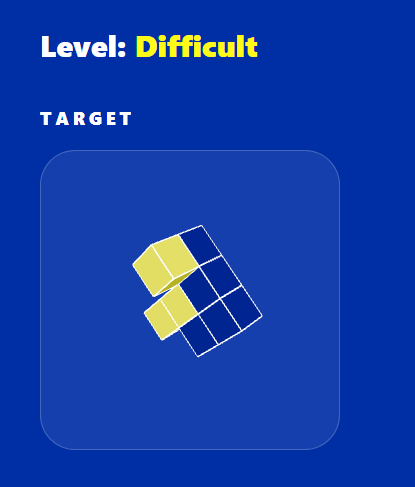
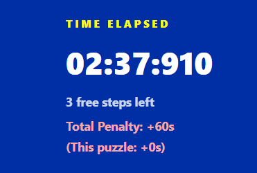

# Spatial Sense

## Deployment

- Application: [https://spatial-sense-api-ajacahh2gpa7hrhz.japaneast-01.azurewebsites.net/](https://spatial-sense-api-ajacahh2gpa7hrhz.japaneast-01.azurewebsites.net/)
- Backend API prefix: `https://spatial-sense-api-ajacahh2gpa7hrhz.japaneast-01.azurewebsites.net/api`
- Example API endpoint: [https://spatial-sense-api-ajacahh2gpa7hrhz.japaneast-01.azurewebsites.net/api/puzzles/random](https://spatial-sense-api-ajacahh2gpa7hrhz.japaneast-01.azurewebsites.net/api/puzzles/random)
- Scalar API docs: [https://spatial-sense-api-ajacahh2gpa7hrhz.japaneast-01.azurewebsites.net/scalar/v1](https://spatial-sense-api-ajacahh2gpa7hrhz.japaneast-01.azurewebsites.net/scalar/v1)

## Introduction
Spatial Sense is a gamified spatial reasoning test where players solve a series of 3D block-rotation puzzles as quickly and accurately as possible. Instead of answering traditional static test questions, the player interacts with a live 3D object, rotates it around the X, Y, and Z axes, and tries to match it to a target shape.

The project is built as a full-stack web application with a React frontend. This project uses .NET for the backend, implemented as an ASP.NET Core Web API with Entity Framework Core for database access. 

## How the Project Relates to Gamification

Spatial Sense adds gamification features to a traditional static spatial reasoning test. The goal is to make the assessment feel more engaging, motivating, and replayable.

The core skill is still spatial reasoning, because players need to mentally rotate and compare 3D objects. The gamified parts are added around that core activity:

- Timed levels that encourage focus and replay.
- Easy, Medium, and Difficult modes for progression.
- A 10-puzzle game loop with visible progress.
- Score saving so players can improve their personal best.
- A leaderboard that ranks players by completion time.
- Sound effects, completion feedback, and visual success states.
- An animated tutorial that teaches the controls before or during play.

Together, these features turn a boring spatial reasoning activity into a challenge-based game where players can practise, compete, and improve over time.

## What Makes the Project Unique

Spatial Sense is worth highlighting because it is not only a normal learning app with points or a leaderboard added on top. A lot of gamified learning projects still keep the main activity quite static, such as answering quiz questions or clicking through levels. My project makes the spatial reasoning test activity itself interactive. The player does not just look at a shape and choose an answer. They rotate the 3D block directly, see how the shape changes, and use that interaction to test their spatial reasoning.

Another feature that makes the project different is the puzzle system. The backend does not only show one fixed set of questions. It generates connected block shapes across different difficulties, so the test has more variety. I also added coloured cubes because they make the orientation more precise. Without colours, some blocks can look too similar after rotation, but the coloured cubes force the player to pay attention to the exact direction of the shape.



The difficult mode is also more than just making the blocks harder. It can include 45-degree rotations and a penalty system. This means the player needs to think before rotating, because unnecessary moves can increase the final time. I think this makes the game feel more like a proper challenge instead of just a simple 3D toy.



Overall, the unique part of Spatial Sense is that it combines the test, the interaction, and the gamification into one complete flow. The tutorial teaches the controls, the timer and progress make the test feel structured, the penalty system adds strategy, and the saved scores and leaderboard let players compare and improve over time.


## Top 3 Advanced Features Implemented

The top three advanced requirements to mark are:

1. **Theme switching**

  The app supports light and dark mode. The selected theme is managed through the global app state and applied across the interface so the gamepage, navigation, leaderboard, modals, and tutorial remain visually consistent.

2. **State management library**

  The frontend uses Redux Toolkit for application-wide state management. It manages shared state such as the selected difficulty, logged-in user, theme mode, sound setting, tutorial progress, modal visibility, pending scores, and warnings before leaving an active game. This keeps the app state consistent across the home page, game page, leaderboard, authentication modal, profile modal, and tutorial.

3. **End-to-end testing using Cypress**

  The project includes Cypress end-to-end tests for important user flows, including authentication, the home page, tutorial behaviour, and leaderboard behaviour. These tests help verify that the frontend works correctly from a user's perspective and that key interactions continue to work as the application changes.

Additional robustness features implemented:

4. **Security measures**

   The project implements multiple security measures that are important for protecting user accounts and backend APIs. Passwords are not stored as plain text; they are hashed before being saved and verified during login. The backend also validates user input for registration, login, score saving, avatar uploads, and user updates so invalid or unsafe data is rejected before it reaches the database. API rate limiting is also used to reduce brute-force login attempts, and repeated write requests.

   The project also includes error handling for common invalid input and temporary service issues. Empty login or registration fields, weak passwords, duplicate usernames or emails, invalid score submissions, missing users, and unsupported avatar files are rejected with clear API responses. On the frontend, loading, empty, and failure states are shown for leaderboard and account actions, while retry handling helps reduce failures caused by temporary database wake-up delays.

5. **API protection and optimisation**

   The backend uses separate rate-limiting policies for general API requests, authentication requests, and write requests. This improves reliability by reducing excessive traffic to sensitive endpoints such as login, registration, and score submission.

## Basic Requirements

### Frontend

- [x] Built using React with TypeScript.
- [x] Responsive and visually styled UI for desktop and mobile.
- [x] Navigation uses React Router.
- [x] Frontend is deployed with the application. The React frontend is built into static assets and deployed with the ASP.NET Core App Service. The backend serves these frontend assets together with the API, so the deployed application includes both the frontend interface and backend functionality.
- [x] Unit tests cover key frontend components and functionality.

### Backend

- [x] Built using C# with .NET 10.
- [x] Uses Entity Framework Core.
- [x] Uses SQL Server for data persistence.
- [x] User account CRUD is implemented through registration/create, profile read, avatar/profile update, and account deletion.
- [x] Backend is deployed with the application.
- [x] Unit tests cover key backend controllers and services.
- [x] Scalar API documentation is exposed at `/scalar/v1`.

### Project management

- [x] Comprehensive Git usage with regular commits showing development progress.
- [x] Proper `.gitignore` is included to avoid committing build output, dependencies, local configuration, and sensitive files.

This project significantly exceeds the minimum requirements:

- [x] **All basic requirements** are implemented and documented.
- [x] **At least 3 advanced requirements** are implemented, including theme switching, Redux state management, and Cypress end-to-end testing.
- [x] **Complete full-stack user flow** from tutorial, gameplay, authentication, score saving, avatar upload, and leaderboard ranking.
- [x] **Theme compliance** through a gamified spatial reasoning experience with interactive 3D block rotation, timed challenges, progress feedback, and penalty mechanics.
- [x] **Robustness features** including input validation, API rate limiting, retry handling, and clear frontend loading/error states.

## Tech Stack

- Frontend: React, TypeScript, Vite, Tailwind CSS, Redux Toolkit, React Router, Three.js, React Three Fiber.
- Backend: ASP.NET Core (.NET 10), Entity Framework Core, SQL Server, OpenAPI, Scalar API docs.
- Deployment: Azure App Service for the deployed ASP.NET Core app, backend API, static frontend assets, and API documentation.
- Testing: Vitest, Cypress, xUnit.

## Planning, Design, and AI Evidence

The `/specs` folder contains planning notes, design evidence, AI prompt logs, agent instructions, and context/config notes used during development. These files show evidence of planning, design decisions, and AI-assisted development throughout the project.

## Testing Commands

Frontend unit tests:

```bash
cd frontend
npm run test:run
```

Frontend end-to-end tests (make sure the frontend and backend are running first):

```bash
cd frontend
npm run e2e
```

Backend tests:

```bash
dotnet test backend.Tests/Backend.Tests.csproj
```

## Running the Project

### 1. Clone the repository

```bash
git clone https://github.com/liqinshen9/Spatial-Sense.git
cd spatial-sense
```

### 2. Set up the backend database

The backend uses ASP.NET Core (.NET 10), Entity Framework Core, and SQL Server. Before running the backend, add the SQL Server connection string to `backend/appsettings.json`.

For security, the real database connection string is stored in a separate local text file. Copy that connection string and paste it into the empty `DefaultConnection` value inside `backend/appsettings.json`.

```json
"ConnectionStrings": {
  "DefaultConnection": "please-paste-your-connection-string-here"
}
```

### 3. Apply the database migrations

From the backend folder, run:

```bash
cd backend
dotnet ef database update
```

If `dotnet ef` is not installed, install it first:

```bash
dotnet tool install --global dotnet-ef
```

### 4. Start the backend

In one terminal, from the `backend` folder, run:

```bash
dotnet run
```

The backend runs at:

```text
http://localhost:5000
```

### 5. Install and start the frontend

In a second terminal, from the project root, run:

```bash
cd frontend
npm install
npm run dev
```

The frontend runs at the local URL shown by Vite, usually:

```text
http://localhost:5173
```

Make sure the backend is still running while using the frontend, because the frontend calls the backend API for authentication, puzzles, avatars, and leaderboard scores.


## Self Reflection

> **Important limitation:** Because the database is hosted on a free tier, it can take time to wake up after being inactive. This means the tutorial mode may sometimes have display issues on both mobile and desktop, especially when it moves to the game page before the puzzle block has fully loaded. I tried to reduce this by adding a frontend retry handling, loading states, and tutorial checks that wait for the game block before highlighting it. These changes make the problem less likely, but they cannot fully prevent delays when the hosting service pauses the database. Next time, I would use a paid tier or non-pausing database option so the app is always ready. I would recommend to test the tutorial animation last if it is not working for the first time.

If I were to do this project again, I would explore adding more transformation types (such as scaling, translating or even shearing), more varied shapes, and more puzzle mechanics. I did not implement too many extra transformations in this version because I wanted to avoid increasing the user's cognitive load and keep the interface clear and easy to understand.

I would also improve the procedural puzzle generation system. The current backend does filter out some weak puzzles, such as targets that are already solved, targets where important coloured cubes are hidden, and Medium/Difficult puzzles that can be solved with only simple 90-degree rotations. However, it does not fully prevent every possible symmetrical or ambiguous shape. With more time, I would add stronger symmetry detection so generated puzzles are more consistently fair and challenging.

With more time, I would also design the light mode interface more carefully in Figma before development. This would help me test different layouts, improve the visual hierarchy, and make the gameplay experience even more polished and intuitive.
